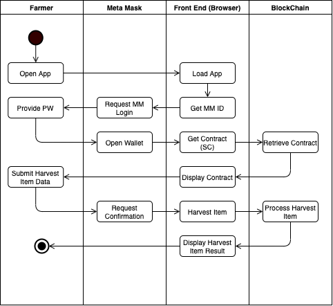

# Supply Chain

## UML

### Class Diagram


### Activity Diagram

The following Activity Diagram shows the harvest item activity.




### Sequence Diagram


### State Diagram


## Libraries & Tools

The following libraries have been used


|Library|Description|Usage|
|---|---|---|
|ganache-cli|Ganache library is used vor communication to the Ganache Test Blockchain|Development|
|lite-server|Simple Web Server for the development process|Development|
|prettier|Code formatter.|Development|
|truffle|Solidity library for development.|Development, Deployment|
|truffle-assertions|Solidity library for testing.|Development|
|truffle-contract|Solidity library for contract.|Development, Deployment|
|truffle-hdwallet-provider|Library used for deployment to Rikeby network.|Deployment|
|web3|Javascript Library for web3 (ETH) access.|Runtime|
|jquery|Javascript Library html programming.|Runtime|
|tooltipster|Javascript Library for tooltips.|Runtime|
|Ganache app|Installable Application Ethereum Blockchain Backend|Development|


## IPFS

IPFS file upload (add) and download (cat) is used via the `ipfs.infura.io` web service. Calls are done by the JavaScript `fetch` calls:

### Upload:

```javascript
let res = await fetch('https://ipfs.infura.io:5001/api/v0/add?pin=false', {
      // Your POST endpoint
      method: 'POST',
      mode: 'cors',
      headers: {
        //'Content-Type': 'multipart/form-data; boundary=----'
      },
      body: formData 
    });

```

###Download:

```javascript

'https://ipfs.infura.io:5001/api/v0/cat?arg=' + App.productImageHash

```

## General Write Up

### Use Cases

The SupplyChain contract support the tracking of a coffee good (item). The following steps are executed by the different persons (roles):

**Farmer**

- harvest item (cut and collect)
- process item (roasting)
- pack item 
- sell item with a price tag

A **Distributor** can then 

- buy the item (his address is saved in the item)
- ship the item

A **Retailer**
- can receive the item (confirm receiving and his address is saved in the item)

A **Consumer**
- purchase the items


Remark for Testing purposes, every user (address) can manage its roles itself.
In a 'real world' scenario this might be restricted by the Contract Owner.


 

### Transaction Overlay

Transactions are displayed by a HTML Overlay. This prevents the user from continuing to start further transaction which might cause errors and confusions.

 


### Contract Ownership Change

Ownership can be handled by the User Interface.
 


## Rikeby Deployment


### SupplyChain Contract Transaction (Contract Creation)

0x8b3d59667d2a6fe0c2fac6521a459a2749cc6b72c4927cead19bc232b91e61cd

### SupplyChain Contract Address

0x5320CE7D2426520139dFbeE34a73bA60efc783Fb


### SupplyChain Contract Owner

0x29c7560d5C0593AEE0d42Ab18018D5a208901F60


### Second Address

0x15dE60c3aEa2C21Fd1706C4A6aC0aA2Db105554c
